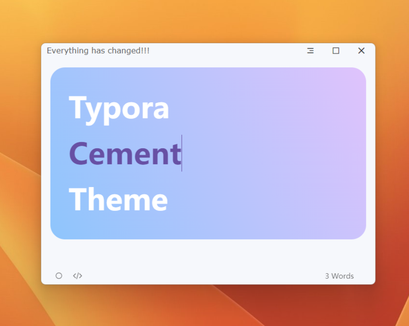
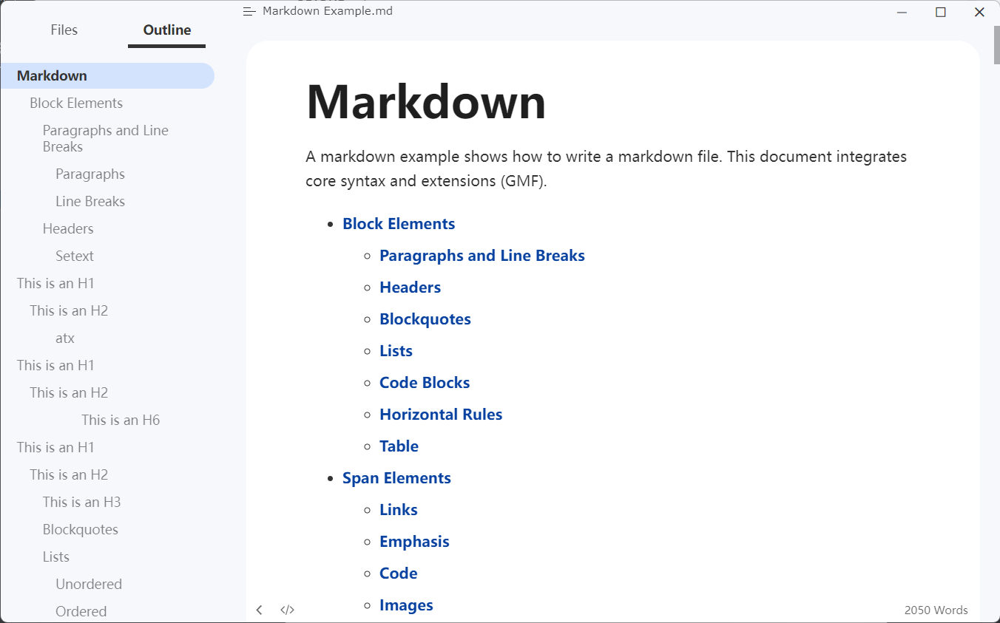
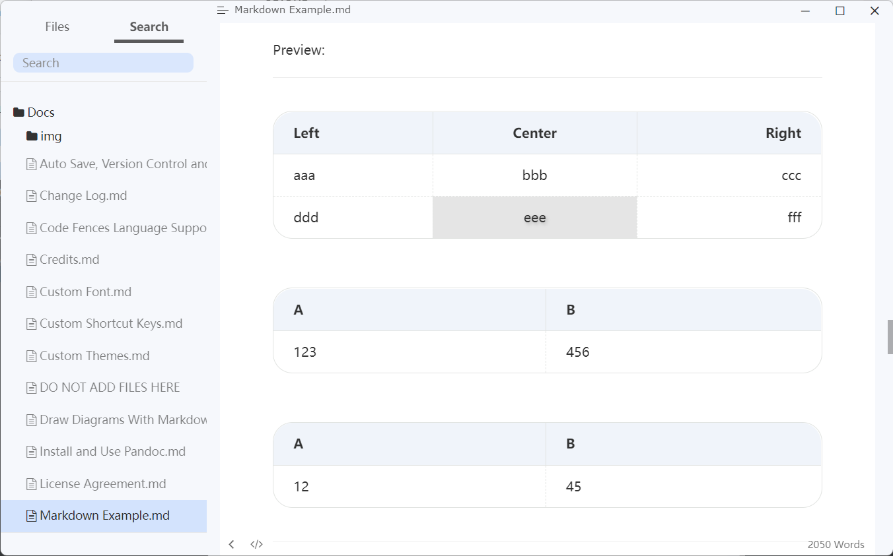
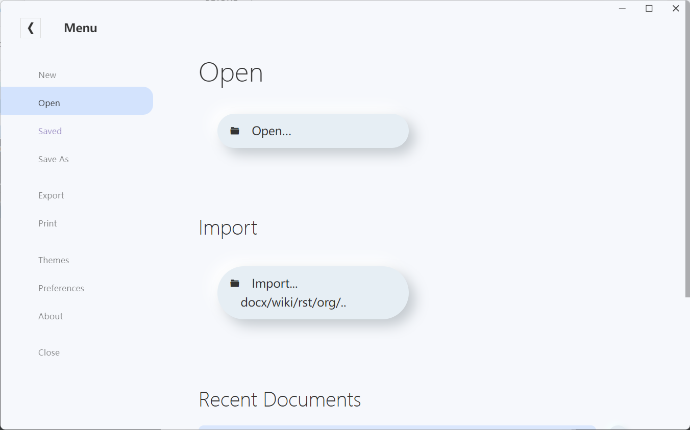
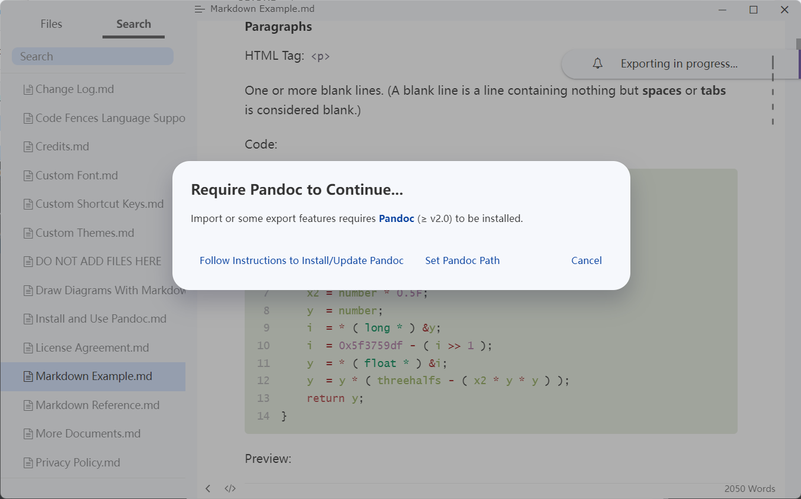
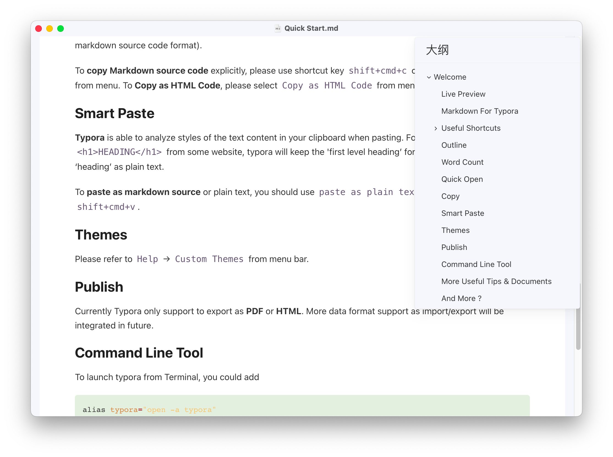
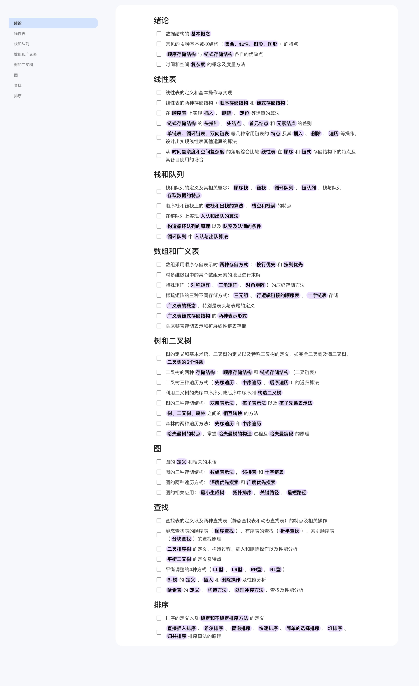

# Typora-Cement-Theme
Typora theme: Cement.

---

### 如何使用

1. [下载打包好的压缩包]([Releases · AntonVanke/Typora-Cement-Theme (github.com)](https://github.com/AntonVanke/Typora-Cement-Theme/releases/))

2. 打开`Typora`->`文件`->`偏好设置`->`外观`->`打开主题文件夹`

3. 复制`cement.css`文件、`cement`文件夹到主题文件夹下

4. 重启`Typora`

5. 打开`Typora`->`主题`->选择`Cement`

详情请查看[Install Theme (typora.io)](https://theme.typora.io/doc/Install-Theme/)

### 预览

### 导出预览

### LICENSE

> MIT License
>
> Copyright (c) 2022 AntonVanke
